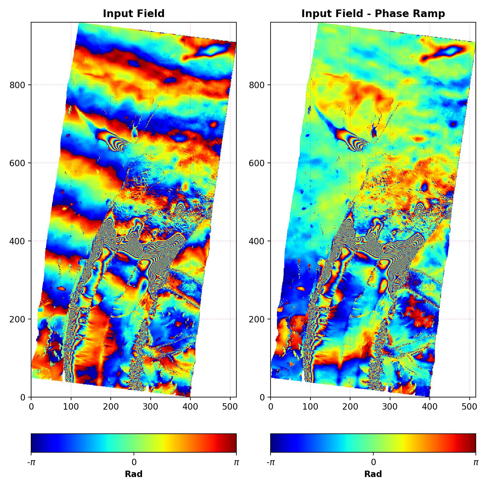

## Estimate and Remove a Linear  Phase Ramp from Differential Interferograms.

[![Language][]][1]
[![License][]][2]

Estimate and remove the contribution of a *Linear Ramp* to the **Wrapped
Phase** of the considered Differential InSAR Interferograms.

## **Scripts**:

1. **remove_phase_ramp.py** - Find the Phase Ramp optimal parameters
    employing a Grid Search approach. A first guess of the ramp
    parameters - e.g. number of cycles along columns and rows - must be
    provided by the user.

2. **remove_phase_ramp_fft.py** - Estimate the Linear Phase Ramp in the
    Frequency Domain as the maximum value of the Power Spectrum of the
    Signal.

## **Scripts**:

**Install Python Dependencies**:

> pip install -r requirements.txt

**PYTHON DEPENDENCIES**:  
-   [numpy: The fundamental package for scientific computing with Python.][]
-   [rasterio: access to geospatial raster data.][]
-   [matplotlib: Library for creating static, animated, and interactive visualizations in Python.][]

# License

The content of this project is licensed under the [Creative Commons
Attribution 4.0 Attribution license][] and the source code is licensed
under the [MIT license][].

  [Language]: https://img.shields.io/badge/python%20-3.7%2B-brightgreen
  [1]: ..%20image::%20https://www.python.org/
  [License]: https://img.shields.io/badge/license-MIT-green.svg
  [2]: https://github.com/eciraci/ee_insar_test/blob/main/LICENSE
  [numpy: The fundamental package for scientific computing with Python]:
    https://numpy.org
  [rasterio: access to geospatial raster data]: https://rasterio.readthedocs.io
  [matplotlib: Library for creating static, animated, and interactive visualizations in Python.]:
    https://matplotlib.org
  [Creative Commons Attribution 4.0 Attribution license]: https://creativecommons.org/licenses/by/4.0/
  [MIT license]: LICENSE